#  DataChain - Data Context Layer for Object Storage

[](https://pypi.org/project/datachain/)
[](https://pypi.org/project/datachain)
[](https://codecov.io/gh/datachain-ai/datachain)
[](https://github.com/datachain-ai/datachain/actions/workflows/tests.yml)
[](https://deepwiki.com/datachain-ai/datachain)


**Object storage provides files, not structure.**

DataChain is a Python library for processing data in object storage.

It adds:
- named datasets
- incremental updates (delta)
- data checkpoints
- lineage (how data was produced)

DataChain records data operations as you read, transform, and save data. From this, it builds a **knowledge graph** that agents (like Claude Code, Codex, and Cursor) can query to reuse datasets and dependencies instead of reprocessing raw files.

This works like persistent data memory for agents.

Built for ML engineers working with Physical AI, Robotics, and other large-scale unstructured data:
- Data lives in S3, GCS, Azure or local filesystem
- Not only tables — images, video, sensors, documents
- Agents hallucinating and write slow, non-resumable, unreliable code

## 1. Install

```bash
pip install datachain
```

DataChain exposes two agent skills:
- `dc-core` — dataset and storage operations
- `dc-graph` — creating knowledge graph

Install both for your agent:
```bash
datachain skill install --target claude   # or --target cursor, --target codex
```

Now you agent knows how to work with storages using datachain and it's knowledge graph. Start vibe coding:
```bash
claude
```

## 2. Example (manual coding)

Process images and store embeddings as a dataset. `embed.py`:

```python
import datachain as dc

(
    dc.read_storage("s3://my-bucket/**/*.jpg", update=True, delta=True)
    .settings(parallel=8)
    .map(embedding=embed_file)
    .save("embeddings")
)
```

Result:
- dataset embeddings@0.0.1
- only new or changed files are processed on subsequent runs
- lineage includes transformation code and input dependencies
- efficient - parallel execution with prefetching

### 2.1. Incremental update

Re-run the script after new data arrives.
```python
python embed.py
```

Result:
- embeddings@0.0.2 was created
- only new jpg files from the bucket were processed


How does datachain know - from the dataset state and lineage.

### 2.2. Checkpoint

If the run fails - fix the issue and re-run:

```python
vi embed.py # fix
python embed.py
```

Result:
- embeddings@0.0.3 was created
- only not-processed file were processed.

How does datachain know - from dataset checkpoint that automatically created under the hood.

## 2. Using agents (vibe coding)

The same workflow can be generated by an agent. Prompt:
> Find outdoor scenes and compute embeddings

The same result:
- dataset embeddings@0.0.1
- code generated and saved (e.g. embed.py)
- efficient processing (parallel, incremental)

Next time you ask:

> there are new outdoor scenes in the bucket. Update embeddings.

It'll run the script again and save embeddings@0.0.2 without recomputing the old ones.

## 3. How it works



DataChain has two layers:

**Operational layer** (ground truth):
- registry of datasets
- schemas and source code of datasets
- lineage: dependencies between them
- stored in `.datachain/db`

**Knowledge graph**
- dataset summaries derived from operational data
- dataset evolution
- used by agents for queries
- stored in `.datachain/graph/`

Core abstraction: **dataset**
- name, version, references to dependency datasets
- references to files (no data copy)
- metadata (per file) like embeddings and scores
- stored in `.datachain/db`

**Agents query the knowledge graph instead of inferring state from raw files.**

## 4. Hard Problems, Solved

Physical AI, robotics, neuroscience — these domains have the hardest data problems. Complex schemas, multi-sensor alignment, nested types. Hard for people. Straightforward for an agent that has data context.

### 4.1. Multimodal schemas

Sensor data doesn't fit in tables. LiDAR arrives as point clouds, camera as JPEG frames, radar as CSVs - each with its own schema. SQL tables can't model this.

DataChain uses Pydantic instead of tables — define the schema once, every agent knows what the data contains.

**Your data is not tabular. Don’t force it to be.**

Prompt:

> New lidar data is periodically coming to s3://bucket/lidar/. I need a dataset that contains all the metadata in a useful format to mix it with my other dataset.

```python
import datachain as dc
from pydantic import BaseModel


class LidarScanInfo(BaseModel):
    width: int
    height: int         # > 1 means ring-organized scan
    n_points: int
    fields: list[str]   # ["x", "y", "z", "intensity", "ring", "time"]
    data_format: str    # "binary" | "binary_compressed" | "ascii"

class LidarViewpoint(BaseModel):
    tx: float; ty: float; tz: float
    qw: float; qx: float; qy: float; qz: float

class LidarMeta(BaseModel):
    sensor_id: str
    timestamp_us: float
    scan: LidarScanInfo
    viewpoint: LidarViewpoint


def parse_lidar(file: dc.File) -> LidarMeta:
    ...

lidar = (
    dc.read_storage("s3://bucket/lidar/**/*.pcd", update=True, delta=True)
    .settings(parallel=8)
    .map(lidar=parse_lidar)
    .save("lidar")
)
```

Each `.save()` create records in the operational database and enriches the knowledge graph.

The next agent that needs LiDAR data will find it.

## 4.2 Complex Processing

Multi-sensor alignment, temporal joins, nested types — an agent with context writes this in one shot.

Without DataChain, this prompt produces confusion:

❯ Align lidar signals with camera frames by nearest frame within a 100ms window. One camera frame per LiDAR scan. Save the result as lidar-camera-aligned.

Without context, an agent hits a wall immediately: What datasets exist? What's frame? What columns? Which pipeline flagged edge cases?

A human would spend days manually analysing data and answering these questions before writing a line of code.

With DataChain, the agent knows context and best practices already:

```python
lidar_100ms = (
    dc.read_dataset("lidar")
    .mutate(time_100ms=dc.C("lidar.timestamp_us") // 100_000)
)

camera_100ms = (
    dc.read_dataset("camera-frames")
    .mutate(time_100ms=dc.C("cam.timestamp_us") // 100_000)
)

# coarse align on 100ms bucket, then pick nearest camera frame per bucket
w = func.window(partition_by="time_100ms", order_by="cam.timestamp_us")

(
    lidar_100ms.merge(camera_100ms, on="time_100ms")
    .mutate(rank=func.row_number().over(w))
    .filter(dc.C("rank") == 1)
    .save("lidar-camera-aligned")
)
```

**This is what agents look like when they have data context.**

## 5. Studio

DataChain starts locally — but data context shouldn’t live on one machine.

Studio makes datasets, and context shared across your team:
- everyone sees the same datasets and versions
- access control to data
- pipelines and results are reproducible (not it worked at my machine issues)
- UI for data (video, DICOM, NIfTI, etc) and lineage graphs

You can process data at scale with:
- scheduling
- scalable compute (100s of CPU/GPU)

```bash
$ datachain auth login
$ datachain job run --workers 20 --cluster gpu-pool embed.py
✓ Job submitted → studio.datachain.ai/jobs/1042
Processing 5,000 new files (495,000 unchanged)...
Done. embeddings@v0.0.2
```

See [studio.datachain.ai](https://studio.datachain.ai)

## Contributing

Contributions are very welcome. To learn more, see the [Contributor Guide](https://docs.datachain.ai/contributing).

## Community and Support

- [Report an issue](https://github.com/datachain-ai/datachain/issues) if you encounter any problems
- [Docs](https://docs.datachain.ai/)
- [Email](mailto:support@datachain.ai)
- [Twitter](https://twitter.com/datachain_ai)
