#  DataChain - Data Context Layer for Object Storage

[](https://pypi.org/project/datachain/)
[](https://pypi.org/project/datachain)
[](https://codecov.io/gh/datachain-ai/datachain)
[](https://github.com/datachain-ai/datachain/actions/workflows/tests.yml)
[](https://deepwiki.com/datachain-ai/datachain)

Teams and data agents fail without data context - schemas alone don't capture what data means, how it was produced, or what's already been computed. The solution is a context layer: multiple layers of metadata, lineage, and code-derived knowledge that ground both humans and agents in what actually exists.

DataChain brings this to unstructured files - images, video, documents, sensor data - stored in S3, GCS, Azure, or local filesystems.

File pipelines are expensive to run and fragile to maintain without it:
- crash → start over
- new data → recompute everything
- expensive calls → pay twice (tokens, GPU, time)
- no shared understanding of what exists → duplicate work

DataChain adds two layers:
1. **Operational layer** that persists schemas, versions, lineage, and processing state.
2. **Knowledge layer** derived from it - readable by your team and your agents - that captures what your data is, what produced it, and what's already been computed.


```bash
pip install datachain                                      # core
datachain skill install --target claude                    # knowledge layer + code generation
# also: --target cursor, --target codex
```

Works with S3, GCS, Azure, and local filesystems.


## 3. Datasets

### 3.1. Create a dataset

DataChain indexes your storage and metadata into a **versioned, queryable dataset** - no data copied, just typed metadata and file pointers. Re-runs only process new or changed files.

```python
from PIL import Image
import io
from pydantic import BaseModel
import datachain as dc

class ImageInfo(BaseModel):
    width: int
    height: int

def get_info(file: dc.File) -> ImageInfo:
    img = Image.open(io.BytesIO(file.read()))
    return ImageInfo(width=img.width, height=img.height)

ds = (
    dc.read_storage(
        "s3://my-bucket/pets/images/**/*.jpg",
        anon=True,
        update=True,
        delta=True,         # re-runs skip unchanged files
    )
    .settings(prefetch=20, cache=True)   # files cached locally for downstream pipelines
    .map(info=get_info)
    .save("pets_images")
)
ds.show(5)
```

`pets_images@1.0.0` is now the shared reference to this data - schema, version, lineage, and metadata.

Every `.save()` registers the dataset in DataChain's **operational data layer* - the persistent store for schemas, versions, lineage, and processing state, kept locally in SQLite DB `.datachain/db`. Pipelines reference datasets by name, not paths. When the code or input data changes, the next run bumps dataset version.

This is what makes a **dataset a management unit:** owned, versioned, and queryable by everyone on the team.

### 3.2. Schemas and types

DataChain uses Pydantic to define the shape of every column. The return type of your UDF becomes the dataset schema — each field a queryable column in the operational layer.

`show()` in the previos script renders nested fields as dotted columns:

```bash
file                            breed         info.width  info.height
 pets/images/beagle_1.jpg        beagle               640          480
 pets/images/beagle_2.jpg        beagle               512          384
 pets/images/Abyssinian_1.jpg    Abyssinian           800          600
 pets/images/boxer_5.jpg         boxer                720          540
 pets/images/Russian_Blue_3.jpg  Russian_Blue        1024          768
```

`.schema()` renders it's schema:
```bash
...
```

Models can be arbitrarily nested - a `BBox` inside an `Annotation`, a `List[Citation]` inside an LLM Response - every leaf field stays queryable the same way. The schema lives in the operational layer and is enforced at dataset creation time.

The operational layer handles datasets of any size - 100 millions of files, hundreds of metadata rows - without loading anything into memory. **Pandas is limited by RAM; DataChain is not.** Export to pandas when you need it, on a filtered subset:

```python
df = dc.read_dataset("pets_images").filter(dc.C("info.width") > 500).to_pandas()
```

### 3.3. Fast queries

Filters, aggregations, and joins run as vectorized operations directly against the operational layer - metadata never leaves your machine, no files downloaded.

```python
import datachain as dc

count = (
    dc.read_dataset("pets_images")
    .filter(
        (dc.C("info.width") > 500) &
        ~dc.C("file.path").like("%cocker_spaniel%")   # case-sensitive
    )
    .count()
)
# Milliseconds, even at 100M-file scale
```

## 4. Resilient Pipelines

When computation is expensive, bugs and new data are both inevitable. DataChain tracks processing state in the operational layer — so crashes and new data are handled automatically, without changing how you write pipelines.

### 4.1. Data checkpoints

```python
# embed.py
import open_clip, torch, io
from PIL import Image
import datachain as dc

model, _, preprocess = open_clip.create_model_and_transforms("ViT-B-32", "laion2b_s34b_b79k")
model.eval()

counter = 0

def encode(file: dc.File, model, preprocess) -> list[float]:
    global counter
    counter += 1
    if counter > 236:                                    # ← bug: remove these two lines
        raise Exception("some bug")                      # ←
    img = Image.open(io.BytesIO(file.read())).convert("RGB")
    with torch.no_grad():
        return model.encode_image(preprocess(img).unsqueeze(0))[0].tolist()

(
    dc.read_dataset("pets_images")
    .settings(batch_size=100)
    .setup(model=lambda: model, preprocess=lambda: preprocess)
    .map(emb=encode)
    .save("pets_embeddings")
)
```

It fails due to a bug in the code:
```
$ python embed.py
████░░░░░░░░░░░░░░░░░░░░  231 / 10,000   ✗ Exception: some bug
```

Remove the two marked lines and re-run - DataChain resumes from image 201, the start of the last uncommitted batch:

```
$ python embed.py
Resuming from checkpoint (200 / 10,000)...
████████████████████████ 10,000 / 10,000  ✓
Saved pets_embeddings@1
```

### 4.2. Similarity search

The vectors live in the operational layer alongside all the metadata - `list[float]` type in pydentic schemas. Querying them is instant - no files re-read and can be combined with not vector filters like `info.width`:

Prepare data:
```bash
datachain cp s3://dc-readme/fiona.jpg .
```


```python
ref_emb = model.encode_image(
    preprocess(Image.open("fiona.jpg")).unsqueeze(0)
)[0].tolist()

(
    dc.read_dataset("pets_embeddings")
    .filter(dc.C("info.width") > 500)          # from pets_images — no re-read
    .mutate(dist=dc.func.cosine_distance(dc.C("emb"), ref_emb))
    .order_by("dist")
    .limit(3)
    .show()
)
```

Under a second - everything runs against the operational layer.


### 4.3. Incremental updates

The bucket in this walkthrough is static, so there's nothing new to process. But in production - when new images land in your bucket - re-run the same scripts unchanged. `delta=True` in the original dataset ensures only new files are processed end to end while the whole dataset will be updated to `pets_images@1.0.1`:

```python
$ python index.py   # 500 new images arrived
Skipping 10,000 unchanged  ·  indexing 500 new
Saved pets_images@1.0.1  (+500 records)

# Next day:

$ python embed.py
Skipping 10,000 unchanged  ·  processing 500 new
Saved pets_embeddings@2  (+500 records)
```

## 5. Knowledge Base

DataChain maintains two layers. The operational layer is the ground truth - schemas, processing state, lineage, the vectors themselves.
**The knowledge base layer** is derived from it: structured markdown for humans and agents to read. Because it's derived, it's always accurate. The knowledge base is stored in `dc-knowledge/` directoty.

Ask the agent to build it (from Calude Code, Codex or Cursor):
```bash
claude
```

Prompt:
```prompt
Build a knowledge base for my current datasets
```

The skill generates `dc-knowledge/` directory from the operational layer - one file per dataset and bucket:

```bash
$ tree dc-knowledge/
├── index.md
├── buckets/s3/my_bucket.md
└── datasets/
    ├── pets_images.md        # schema, source, record count, version
    └── pets_embeddings.md    # schema, depends_on: pets_images
```

Every DataChain run keeps it current - bucket scans update the bucket files, `.save()` registers new dataset versions. Browse it in any text editor or Obsidian:

GIF_IS_HERE

Useful for people, not just agents. When your team shares a registry, `dc-knowledge/` becomes a living data catalog — what exists, what schema it has, what depends on what, and what has already been computed. It could be commited to Git repository.

## 6. AI-Generated Pipelines

The skill gives the agent data awareness: it reads `dc-knowledge/` to understand what datasets exist, their schemas, which fields can be joined - and the meaning of columns inferred from the code that produced them.

Prompt:

```prompt
Find dogs similar to fiona.jpg.
- Pull breed metadata and mask files from annotations/
- Exclude images without mask
- Exclude Cocker Spaniels
- Only include images wider than 500px
```

The agent parses the annotations directory, identifies pets_embeddings in the knowledge base as the right starting point, and writes a single pipeline joining all three sources with similarity search and structured filters. Without the knowledge base, writing the pipeline alone could take hours - finding the right dataset, days.


Output:
```
┌──────┬──────────────────────┬──────────────┬────────┬──────────┐
│ Rank │        Image         │    Breed     │ Width  │ Distance │
├──────┼──────────────────────┼──────────────┼────────┼──────────┤
│ 1    │ basset_hound_117.jpg │ basset_hound │  512px │  0.221   │
│ 2    │ basset_hound_129.jpg │ basset_hound │  640px │  0.223   │
│ 3    │ beagle_44.jpg        │ beagle       │  580px │  0.251   │
└──────┴──────────────────────┴──────────────┴────────┴──────────┘
```

30 seconds to parse annotations - everything else quieried from the operational layer.

## 7. Architecture

Claude Code (Codex, Cursor, etc) isn't just a chat interface with a shell - it's a harness that gives the LLM repo context, dedicated tools, and persistent memory. That's what makes it good.

DataChain extends that harness to data. The agent that understands your codebase now also understands your storage and datasets: schemas, dependencies, what's already computed, what's mid-run, and what changed since last time.

```
┌──────────────────────┐             ┌──────────────────────┐
│     Claude Code      │─── skill ──▶│      DataChain       │
├──────────────────────┤             ├──────────────────────┤
│  git + commits       │             │  datasets + versions │
│  Prompt caching      │             │  data lineage graph  │
│  file tree           │             │  schemas + types     │
├──────────────────────┤             ├──────────────────────┤
│  Grep / Glob / LSP   │             │  async · parallel    │
│  session memory      │             │  execution state     │
└──────────────────────┘             └──────────────────────┘
          │                                     │
       codebase                           object storage
     (git + files)                    (S3, GCS, AZ, local FS)
```

...


```
┌─────────────────────────────────────────┐
│             your pipelines              │
└───────────────────┬─────────────────────┘
                    │ .save()
        ┌───────────▼──────────┐
        │   operational layer  │  .datachain/db
        │  • dataset registry  │
        │  • typed schemas     │
        │  • processing state  │
        │  • checkpoints       │
        │  • lineage graph     │
        └───────────┬──────────┘
                    │ derived
        ┌───────────▼──────────┐
        │   knowledge graph    │  datachain/graph/
        │  • agent-readable    │
        │  • dataset summaries │
        │  • schema + versions │
        │  • dependency map    │
        └──────────────────────┘
```

**Operational layer** — the ground truth. Every `.save()` records schema, processing state, and lineage. This is what makes incremental updates and crash recovery work.

**Knowledge graph** — derived from the operational layer, stored as structured markdown in `datachain/graph/`. This is what `datachain-graph` skill reads. Instead of guessing at folder structure, the agent reads the graph: what exists, what schema it has, what's already been computed.


## 8. Team and cloud: Studio

Data context built locally stays local. DataChain Studio makes it shared.

```bash
datachain auth login
datachain job run --workers 20 --cluster gpu-pool caption.py
# ✓ Job submitted → studio.datachain.ai/jobs/1042
# Resuming from checkpoint (4,218 already done)...
# Saved oxford-pets-caps@0.0.1  (3,182 processed)
```



Studio adds: shared dataset registry, access control, UI for video/DICOM/NIfTI/point clouds, lineage graphs, reproducible runs.

Bring Your Own Cloud — all data and compute stay in your infrastructure. AWS, GCP, Azure, on-prem Kubernetes.

→ [studio.datachain.ai](https://studio.datachain.ai)

## 9. Contributing

Contributions are very welcome. To learn more, see the [Contributor Guide](https://docs.datachain.ai/contributing).

## 10. Community and Support

- [Report an issue](https://github.com/datachain-ai/datachain/issues) if you encounter any problems
- [Docs](https://docs.datachain.ai/)
- [Email](mailto:support@datachain.ai)
- [Twitter](https://twitter.com/datachain_ai)
