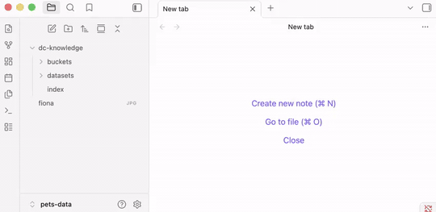

# Knowledge Base

The knowledge base is a structured reflection of your datasets as markdown files in `dc-knowledge/`. Agents read it before writing code. Humans browse it in Obsidian or any markdown viewer. Because it is derived from the operational layer, it is always accurate.

## Install the Skill

```bash
pip install datachain
datachain skill install --target claude     # also: --target cursor, --target codex
```

The skill gives agents data awareness: what datasets exist, their schemas, which fields can be joined, and the meaning of columns inferred from the code that produced them.

## Generate the Knowledge Base

From Claude Code (or Cursor, Codex):

```prompt
Build a knowledge base for my current datasets
```

The skill generates `dc-knowledge/` from the operational layer, one file per dataset and per bucket:

```
dc-knowledge
├── buckets
│   └── s3
│       └── dc_readme.md
├── datasets
│   ├── oxford_micro_dog_breeds.md
│   ├── oxford_micro_dog_embeddings.md
│   └── similar_to_fiona.md
└── index.md
```

Each dataset file carries:

- **Schema**: column names, types, nested structure
- **Lineage**: what produced this dataset, what it depends on
- **Session context**: when it was last updated, by whom
- **Previews**: sample rows and statistics
- **Links**: connections to related datasets

## How Agents Use It

When you ask an agent a data question, the skill reads `dc-knowledge/` to understand what already exists. The agent then builds on prior datasets instead of recomputing from scratch.

```prompt
Find dogs in s3://dc-readme/oxford-pets-micro/ similar to fiona.jpg:
  - Pull breed metadata and mask files from annotations/
  - Exclude images without mask
  - Exclude Cocker Spaniels
  - Only include images wider than 400px
```

The agent decomposes this into steps (embeddings, breed metadata, mask join, quality filter) and saves each as a named, versioned dataset. Next time you ask a related question, it starts from what's already built.

## Browsing

The knowledge base is plain markdown with wikilinks. Open it in:

- **Obsidian**: full graph view, link navigation, search
- **Any markdown viewer**: VS Code, GitHub, plain text
- **Agent context**: the skill loads relevant files automatically



## Regenerating

Run the skill prompt again to update the knowledge base after creating new datasets. The knowledge base is always re-derived from the operational layer; it never drifts.
