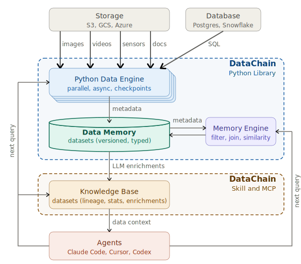

# <a class="main-header-link" href="/" >  DataChain</a>

memory for data agents

  
  
  
  

DataChain chains Python functions and data operations into composable queries. Python functions process files or data and produce data. Data operations run as SQL at warehouse speed: filter, join, aggregate. Because the system sees the full chain before executing, it applies ten layers of automatic optimization, from no-copy file references to dataset reuse. Every query deposits results into **Data Memory** as a versioned, typed dataset, and the next query starts from what the last one produced. Each session enriches what the next session reads; agents and people build new conclusions on top of prior conclusions instead of re-deriving from raw bytes.

The **Python Data Engine** is the production layer: it runs your Python functions in parallel across threads and machines with async prefetch, file caching, and checkpoints. The **Query Engine** (SQLite locally, ClickHouse in SaaS) is the recall layer: it filters, joins, and searches across datasets at warehouse speed. The **Knowledge Base** is the compilation layer that turns persistent datasets into agent-readable knowledge for Claude Code, Codex, Cursor, custom harnesses, and any LLM they support.

**Get Started**

- [🧭 Why DataChain](why.md) — the problem, who it fits, who it does not
- [🤖 Agents](getting-started/agents.md) — AI-driven with a knowledge base
- [🐍 Python](getting-started/python.md) — Full control over data processing
- [💡 Concepts](concepts/index.md) — Memory, Datasets, and the dual engine
- [🧩 Use Cases](use-cases/index.md) — five patterns where the harness changes the work

  

