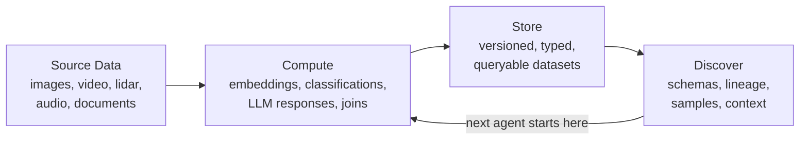

# <a class="main-header-link" href="/" >  DataChain</a>

  
  
  
  

DataChain is data memory for AI.

You process files with AI -- images, video, sensor data, documents -- and produce embeddings, labels, scores, filtered subsets. DataChain saves every result as a versioned, typed, queryable dataset so the next pipeline or agent builds on what already exists instead of starting over.

Without it, derived data lives in throwaway scripts and local files. Agents recompute what was already done because they cannot see it. With DataChain, every result has a schema, lineage, and a name -- findable by the next person or agent that needs it.

## Get Started

- **[Getting Started: Agents](getting-started/agents.md)** -- agents write DataChain pipelines and build a knowledge graph that makes every subsequent task faster
- **[Getting Started: Python](getting-started/python.md)** -- write DataChain pipelines directly for full control over data processing
- **[Concepts](concepts/index.md)** -- understand Data Memory, Datasets, and the dual engine
