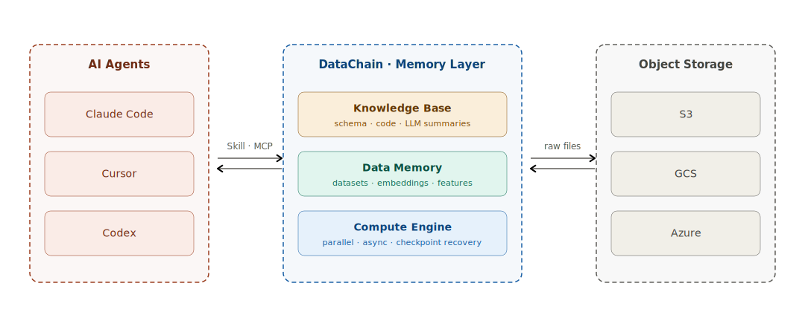

# <a class="main-header-link" href="/" > <span style="display: inline-block;"> DataChain</span></a>

<p align="center" class="subtitle">Datasets for files in S3, GCS, and Azure — typed, versioned, queryable at warehouse speed</p>

<style>
.md-content .md-typeset h1 { font-weight: bold; display: flex; align-items: center; justify-content: center; gap: 5px; }
.md-content .md-typeset h1 .main-header-link { display: flex; align-items: center; justify-content: center; gap: 8px;
 }
.md-content .md-typeset .subtitle { font-size: 1.2em; color: var(--md-default-fg-color--light); margin-top: -0.5em; }
</style>

<p align="center">
  <a href="https://pypi.org/project/datachain/" target="_blank">
    
  </a>
  <a href="https://pypi.org/project/datachain/" target="_blank">
    
  </a>
  <a href="https://codecov.io/gh/datachain-ai/datachain" target="_blank">
    
  </a>
  <a href="https://github.com/datachain-ai/datachain/actions/workflows/tests.yml" target="_blank">
    
  </a>
</p>

```python
import datachain as dc

(
    dc.read_storage("s3://bucket/videos/", type="video")
    .gen(frame=lambda f: f.get_frames(step=30))
    .settings(parallel=8, workers=50)
    .map(embedding=clip_embedding)
    .save("video_frame_embeddings")
)
```

```bash
pip install datachain
```

**Stop reprocessing raw storage every run.**

Your data lives as files in object storage: images, video, documents, sensor recordings. Every script that touches them re-lists the bucket, re-downloads, re-embeds, re-classifies, and the result vanishes when the script ends. The next person, project, or session starts from raw bytes.

DataChain is a Python library that runs your code over those files in parallel and saves the output as a typed, versioned dataset. Files stay in S3, GCS, or Azure; the library captures provenance automatically; the next pipeline reads the dataset instead of recomputing.

## What you get

- **Datasets, not notebooks.** Every `.save()` is named, versioned, and ships with the script that produced it. Lineage and author captured automatically; no YAML to maintain.
- **Warehouse-speed queries.** Filter, join, group_by, and similarity search over millions of typed records, sub-second on SQLite locally and ClickHouse in production.
- **Heavy Python in parallel.** LLM calls, model inference, multimodal extraction with async prefetch, batching, and checkpoint recovery; one chain scales from a laptop to a 300-machine Kubernetes cluster.
- **Files stay in your cloud.** No copies, no migration. Reads happen in place against S3, GCS, or Azure; `read_database()` covers Postgres and Snowflake when you need them.
- **Plays well with the ML stack.** `to_pytorch()` streams batches into training loops, `read_hf()` pulls HuggingFace datasets, native Parquet and Arrow under the hood, vector similarity search in the same query layer as filter and join.

## Recall economics

The work compounds because recall is two orders of magnitude cheaper than recomputing. End-to-end measurements on 1,500-document SEC filings and 1,500-image MS-COCO corpora confirm a five-session compounding ratio of roughly 5×.

| Tier | What it is | Cost per recall |
|---|---|---|
| Raw files | Re-running the producing pipeline (LLM calls, inference, extraction) | ~$100 |
| Datasets | Querying materialised typed records | ~$1 |
| Summaries | Reading schema, lineage, stats | ~$0.01 |

## Where it fits, and where it doesn't

DataChain fits when your data is files in object storage and you want what your team produces to outlive the script that produced it. It is not the right tool for BI on a curated warehouse with a stable schema (dbt plus a semantic layer), conversation memory for one user across chat sessions (Letta or Mem0), or file-blob versioning for a small ML repo (DVC).

## For AI agents

Claude Code, Cursor, and Codex read DataChain through agent skills and an MCP server. Same library, same datasets; the agent sees schemas, lineage, and dataset summaries before generating code, and writes its own outputs back as versioned datasets. See the [agents quickstart](getting-started/agents.md).

<div style="max-width: 720px; margin: 2em auto;">
  
</div>

## Get started

- [Python quickstart](getting-started/python.md) — installation and first chain
- [Where DataChain fits](fit.md) — when to reach for it, when not to
- [Concepts](concepts/index.md) — Compute Engine, Data Memory, Knowledge Base
- [Use cases](use-cases/index.md) — five patterns where the work compounds
