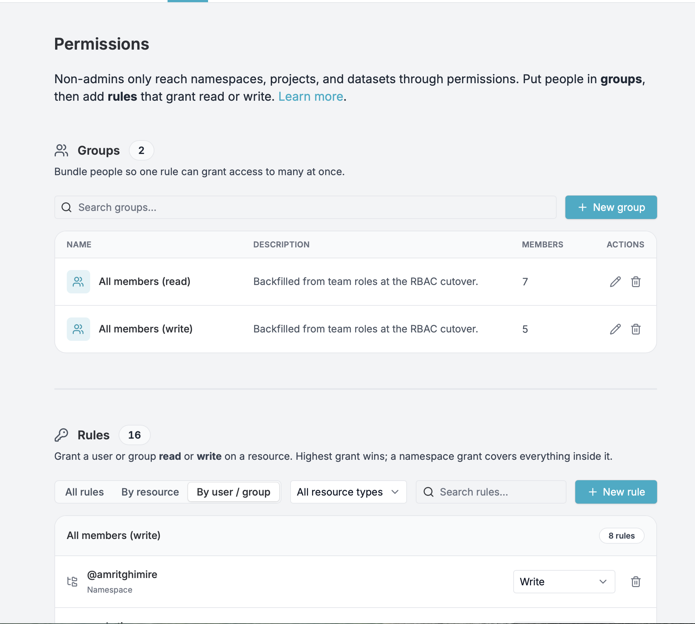
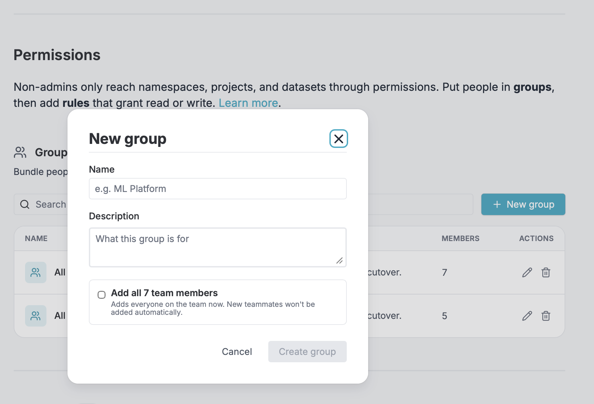
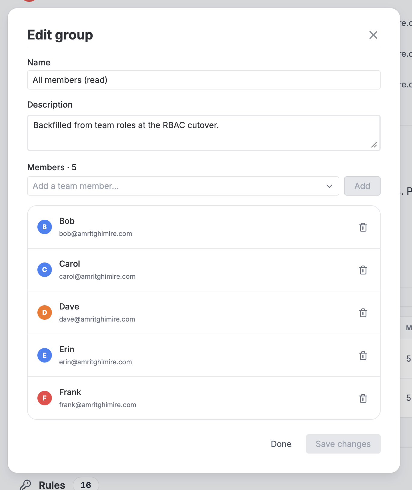
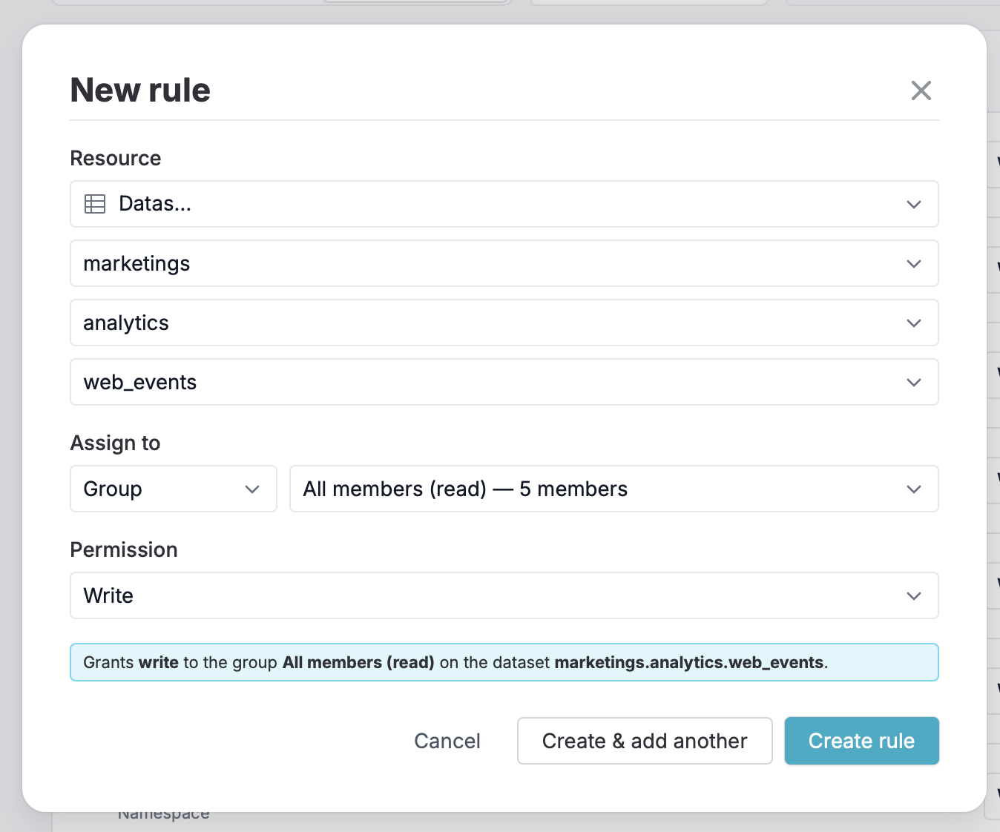
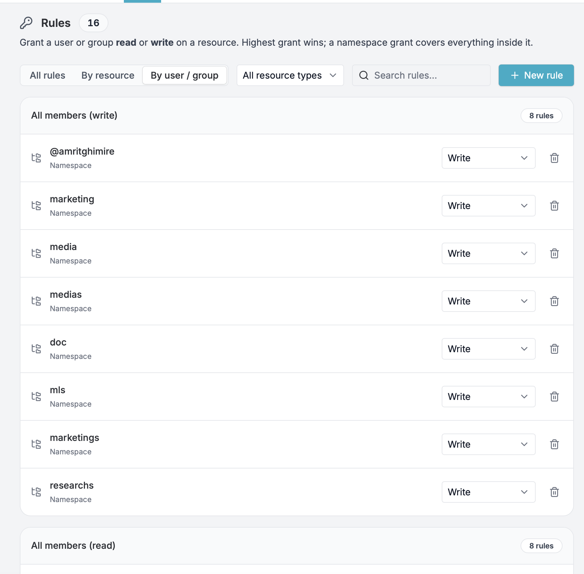

# Teams

DataChain Studio enables collaborative work through teams, allowing you to share
projects, datasets, and jobs with team members. You can create teams with one or
more team members, also called collaborators, and assign different roles to
control what they can do.

Each collaborator has a team role (Admin, Editor, or Viewer). On top of that,
access to individual namespaces, projects, and datasets is controlled by
**fine-grained permissions** , admins organize people into **groups** and write
**rules** that grant `read` or `write` on specific resources.

In this page, you will learn about:

- [How to create a team](#create-a-team)
- [How to invite collaborators (team members)](#invite-collaborators)
- [The privileges (access permissions) of different roles](#roles)
- [How access to resources is resolved](#how-access-is-resolved)
- [How to set up fine-grained permissions (groups and rules)](#permissions)
- [How to manage connections to self-hosted GitLab servers](#manage-connections-to-self-hosted-gitlab-servers)
- [How to configure Single Sign-on (SSO)](#configure-single-sign-on-sso)
- [How to upgrade to an Enterprise plan](#get-enterprise)

## Create a team

Click on the drop down next to `Personal`. All the teams that you have created
so far will be listed within `Teams` in the drop down menu. If you have not
created any team so far, this list will be empty.

To create a new team, click on `Create a team`.


You will be asked to enter the URL namespace for your team. Enter a unique name.
The URL for your team will be formed using this name.


Then, click the `Create team` button on the top right corner.

## Invite collaborators

To add collaborators, enter their email addresses. Each collaborator can be
assigned the [Admin, Edit, or View role](#roles). An email invite will be sent
to each invitee. Then, click on `Send invites and close`.


You can also click on `Skip and close` to skip adding collaborators while
creating the team, and
[add them later by accessing team settings](#edit-collaborators).

## Roles

Every collaborator has one of three team roles. The role controls team-level
capabilities — but, except for admins, it does **not** by itself grant access to
any namespace, project, or dataset. That access comes from
[fine-grained permissions](#permissions).

- **`Admins`** - Have full access to everything in the team. Admins can see and
  modify every namespace, project, and dataset regardless of permission rules,
  invite and remove collaborators, manage groups and rules, manage team settings,
  configure cloud credentials, and manage billing.
- **`Editors`** - Can create resources and, where they have a `write`
  [grant](#permissions), edit datasets, jobs, queries, and projects, upload
  files, and run jobs. They cannot modify team settings, manage collaborators, or
  manage permissions.
- **`Viewers`** - Can explore the resources they have a `read` grant on. They
  cannot create or modify resources, and cannot change team settings.

For both Editors and Viewers, access to a specific resource is determined by
permission rules and groups (see [How access is resolved](#how-access-is-resolved)),
not by the role alone. A collaborator with no matching grant sees no resources.

DataChain Studio does not have the concept of an `Owner` role. The user who
creates the team has the `Admin` role. The privileges of such an admin is the
same as that of any other collaborator who has been assigned the `Admin` role.

!!! note

    If your Git account does not have write access on the Git repository connected
    to a project, you cannot push changes (e.g., new experiments) to the repository
    even if the project belongs to a team where you are an `Editor` or `Admin`.

### How access is resolved

For namespaces, projects, and datasets, DataChain Studio resolves access like
this:

- **Admins bypass everything.** A team admin can read and write every resource,
  no matter what rules exist.
- **Access is grant-only.** For non-admins, access to a resource comes only from
  an explicit permission rule (targeting you or a group you belong to) or from
  ownership. If nothing grants you access, you have none — there is no fallback to
  your team role.
- **Grants are additive; the highest one wins.** If several rules apply to you
  (directly or through groups), you get the highest permission among them. A
  `read` grant never cancels a `write` grant.
- **Rules cascade downward.** A rule on a namespace also covers every project and
  dataset inside it; a rule on a project covers every dataset inside it.
- **Creating a namespace grants you `write` on it.** The creator of a namespace
  automatically gets `write` on that namespace (and, by cascade, on everything
  inside it). Creating a project or dataset inside an existing namespace does not
  add a new grant on its own.

!!! note

    Existing teams keep working after this feature rolls out. Each team starts
    with two ready-made groups — **All members (read)** and **All members
    (write)** — that grant every member access to all existing namespaces. Admins
    can edit or remove these groups to start scoping access down.

**Example.** Suppose a dataset lives at `prod.analytics.metrics`. A rule that
grants the `ml-team` group `read` on the `prod` namespace lets every member of
`ml-team` read `prod.analytics.metrics` (and everything else under `prod`). If
one of those members also has a personal `write` rule on
`prod.analytics.metrics`, they get `write` on it — the higher grant wins.

These rules are enforced everywhere resources are accessed , the web dashboard,
the API, and running DataChain jobs (for example, `dc.read_dataset(...)`) — not
just in the UI.


The tables in this section show what a `read` versus `write`
[grant](#permissions) allows on a resource you can access. Admins can perform
every action regardless of grants.

### Privileges for datasets

| Feature                     | Read | Write |
| --------------------------- | ---- | ----- |
| List datasets               | Yes  | Yes   |
| View dataset information    | Yes  | Yes   |
| View dataset rows           | Yes  | Yes   |
| View dataset versions       | Yes  | Yes   |
| Export datasets             | Yes  | Yes   |
| Preview files               | Yes  | Yes   |
| Create datasets             | No   | Yes   |
| Edit dataset metadata       | No   | Yes   |
| Delete datasets             | No   | Yes   |
| Upload files                | No   | Yes   |
| Move files in storage       | No   | Yes   |
| Delete files                | No   | Yes   |
| Reindex storage             | No   | Yes   |
| Create dataset from storage | No   | Yes   |

### Privileges for jobs

| Feature              | Read | Write |
| -------------------- | ---- | ----- |
| List jobs            | Yes  | Yes   |
| View job details     | Yes  | Yes   |
| View job logs        | Yes  | Yes   |
| List clusters        | Yes  | Yes   |
| Create jobs          | No   | Yes   |
| Cancel running jobs  | No   | Yes   |
| Update job status    | No   | Yes   |

### Privileges for queries

| Feature                 | Read | Write |
| ----------------------- | ---- | ----- |
| List queries            | Yes  | Yes   |
| View query details      | Yes  | Yes   |
| Create queries          | No   | Yes   |
| Update queries          | No   | Yes   |
| Duplicate queries       | No   | Yes   |
| Delete queries          | No   | Yes   |

### Privileges for experiments

| Feature                                       | Read | Write |
| --------------------------------------------- | ---- | ----- |
| Open a team's project                         | Yes  | Yes   |
| View experiments and metrics                  | Yes  | Yes   |
| Apply filters                                 | Yes  | Yes   |
| Show / hide columns                           | Yes  | Yes   |
| Save filters and column settings              | No   | Yes   |
| Add a new project                             | No   | Yes   |
| Edit project settings                         | No   | Yes   |
| Delete a project                              | No   | Yes   |
| Share a project                               | No   | Yes   |

### Privileges for storage and activity logs

| Feature                  | Read | Write |
| ------------------------ | ---- | ----- |
| List storage files       | Yes  | Yes   |
| View activity logs       | Yes  | Yes   |
| Create activity logs     | No   | Yes   |
| Get presigned URLs       | No   | Yes   |

### Privileges to manage the team

These team-management capabilities are governed by the team role itself (not by
permission rules), and are reserved for admins:

| Feature                            | Viewer | Editor | Admin |
| ---------------------------------- | ------ | ------ | ----- |
| Manage team settings               | No     | No     | Yes   |
| Manage team collaborators          | No     | No     | Yes   |
| Manage groups and permission rules | No     | No     | Yes   |
| Configure cloud credentials        | No     | No     | Yes   |
| Manage GitLab server connections   | No     | No     | Yes   |
| Configure Single Sign-on (SSO)     | No     | No     | Yes   |
| Manage team plan and billing       | No     | No     | Yes   |
| Delete a team                      | No     | No     | Yes   |

## Permissions

Team roles are coarse — an Editor can write across everything they're granted, a
Viewer can read it. **Permissions** let admins be specific: sort collaborators
into **groups** and write **rules** that grant `read` or `write` on individual
namespaces, projects, and datasets.

You'll find Permissions under **Collaborators & Permissions** in the team
settings page, below the Collaborators list. This area is **admin-only** — other
collaborators see "Only team admins can manage permissions."

!!! note

    Non-admins only reach namespaces, projects, and datasets through permissions.
    Put people in groups, then add rules that grant read or write.




### Resources: namespaces, projects, and datasets

Rules target a resource in DataChain's hierarchy. A dataset is addressed as:

```
<namespace>.<project>.<dataset>
```

for example `prod.analytics.metrics`. A rule can target any level of this
hierarchy, and it **cascades downward**: a rule on the `prod` namespace covers
every project and dataset inside it, and a rule on `prod.analytics` covers every
dataset in that project. For more on how datasets are organized, see
[Organizing Datasets with Namespace and Project](../../guide/namespaces.md).

### Groups

Groups bundle people so one rule can grant access to many at once.

To create a group, open the **Groups** section and click **New group**. Give it a
name (for example, `ML Platform`) and an optional description. You can tick **Add
all N team members** to seed the group with everyone currently on the team — this
is a one-time snapshot, so new teammates aren't added automatically.



To manage an existing group, use its edit button. From there you can rename it,
edit its description, and add or remove members. Removing a member revokes any
access they had through that group.



Deleting a group asks for confirmation and warns that it *"Deletes this group and
every rule granted through it. Members lose that access but keep their team
role."* Deletion can't be undone.


### Rules

A rule grants a user or a group `read` or `write` on a specific resource. The
highest matching grant wins, and a namespace grant covers everything inside it
(see [How access is resolved](#how-access-is-resolved)).

To add a rule, open the **Rules** section and click **New rule**:

1. **Pick the resource.** Choose the resource type (namespace, project, or
   dataset), then select it through the cascading pickers — for a dataset you
   pick its namespace, then its project, then the dataset.
2. **Assign it.** Choose whether the rule targets a **group** or a **user**, then
   pick which one.
3. **Choose the permission** — **Read** (view only) or **Write** (read &
   modify).



Before you save, the dialog spells out exactly what the rule grants, including
the cascade (for example, "…including every project and dataset inside it"). If a
rule for that user or group on that resource already exists, the dialog offers to
update it to the new permission instead of erroring. Use **Create & add another**
to add several rules without re-walking the resource picker.

Existing rules can be browsed three ways — **All rules**, **By resource**, or
**By user / group** (the default) — and filtered by resource type or search. You
can change a rule's permission inline from its row, or delete it.



## Manage your team and its resources

Once you have created the team, the team's workspace opens up.


In this workspace, you can manage the team's:
- [Datasets](#datasets)
- [Jobs](#jobs)
- [Projects (Experiments)](#projects-experiments)
- [Settings](#settings)

## Datasets

The datasets dashboard shows the datasets you can access , admins see all of the
team's datasets, while other members see the ones they've been granted (see
[Permissions](#permissions)). Whether you can only explore a dataset or also edit
and delete it depends on whether your grant is `read` or `write`.

To create a new dataset, you can upload files, connect to cloud storage, or
create datasets from DataChain queries.

## Jobs

The jobs dashboard shows the DataChain jobs running on the team's compute
clusters. A member with `write` on the relevant resources can create, run, and
cancel jobs; `read` lets you view job status and logs; admins have full control
(see [Permissions](#permissions)).

## Projects (Experiments)

This is the projects dashboard for DVC (acquired by lakeFS) experiment
tracking. Which projects you see, and whether you can edit them, follows the same
[permissions](#permissions) as other resources.

To add a project to this dashboard, click on `Add a project`. The process for
adding a project is the same as that for adding personal projects
([instructions](./experiments/create-a-project.md)).

## Settings

In the [team settings](#settings) page, you can change the team name, add
credentials for the data remotes, and delete the team. Note that these settings
are applicable to the team and are thus different from
[project settings](./experiments/configure-a-project.md).

Additionally, you can also
[manage connections to self-hosted GitLab servers](#manage-connections-to-self-hosted-gitlab-servers),
[configure sso](#configure-single-sign-on-sso),
[edit collaborators](#edit-collaborators), and
[set up fine-grained permissions](#permissions).

### Manage connections to self-hosted GitLab servers

If your team’s Git repositories are on a self-hosted GitLab server, you can go
to the `GitLab connections` section of the team settings page to set up a
connection to this server. Once you set up the connection, all your team members
can connect to the Git repositories on this server. For more details, refer to
[Custom GitLab Server Connection](./git-connections/custom-gitlab-server.md).

### Configure Single Sign-on (SSO)

Single Sign-on (SSO) allows your team members to authenticate to DataChain
Studio using your organization's identity Provider (IdP) such as Okta, LDAP,
Microsoft AD, etc.

Details on how to configure SSO for your team can be found
[here](./authentication/single-sign-on.md).

Once the SSO configuration is complete, users can login to DataChain Studio
using their team's login page at
`http://studio.datachain.ai/api/teams/<TEAM_NAME>/sso`. They can also login
directly from their Okta dashboards by clicking on the DataChain Studio
integration icon.

If a user does not have a pre-assigned role when they sign in to a team, they
will be auto-assigned the [`Viewer` role](#roles).

### Edit collaborators

To manage the collaborators (team members) of your team, go to the
`Collaborators & Permissions` section of the team settings page. Here you can
invite new team members as well as remove or change the [roles](#roles) of
existing team members. To grant access to specific resources beyond a member's
role, use [fine-grained permissions](#permissions).

The number of collaborators in your team depends on your team plan. By default,
all teams are on the Free plan, and can have 2 collaborators. To add more
collaborators, [upgrade to the Enterprise plan](#get-enterprise).

All collaborators and pending invites get counted in the subscription. Suppose
you have subscribed for a 10 member team. If you have 5 members who have
accepted your team invite and 3 pending invites, then you will have 2 remaining
seats. This means that you can invite 2 more collaborators. At this point, if
you remove any one team member or pending invite, that seat becomes available
and so you will have 3 remaining seats.

## Get Enterprise

**To upgrade to the Enterprise plan**, [schedule a call] with our in-house
experts. They will try to understand your needs and suggest a suitable plan and
pricing.

[schedule a call]: https://calendly.com/gtm-2/studio-introduction
