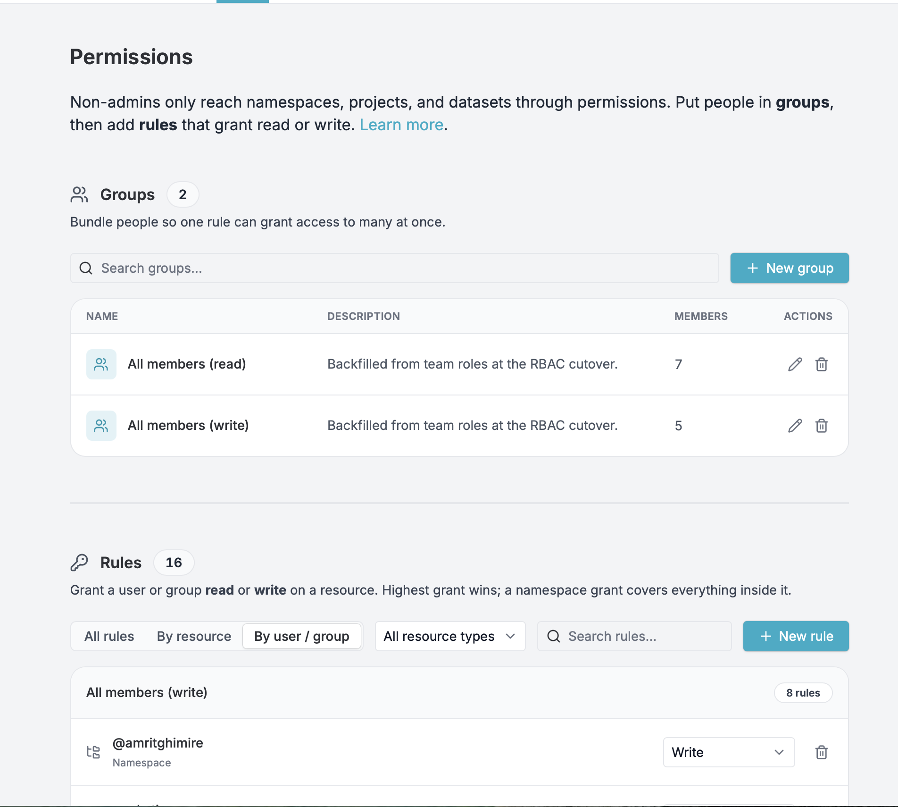
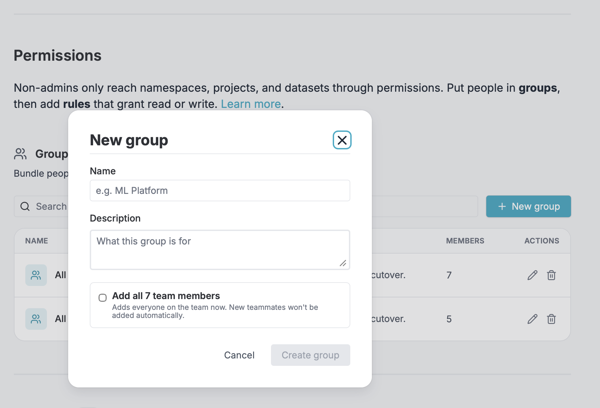
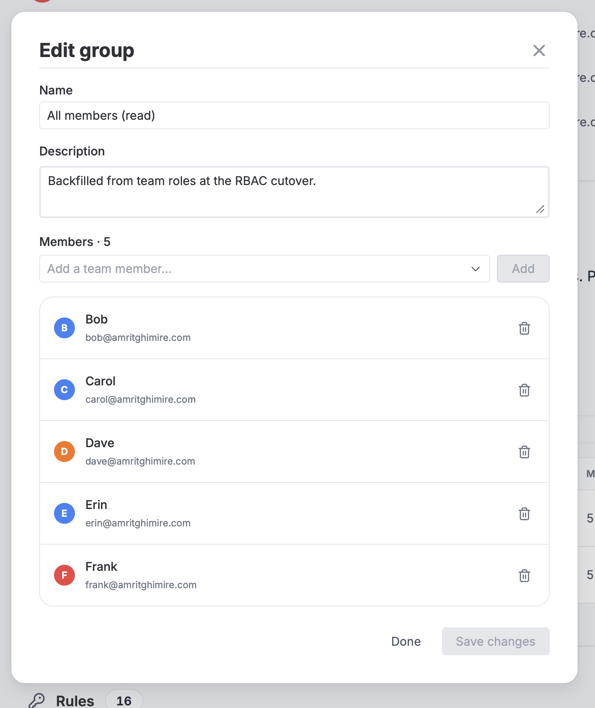
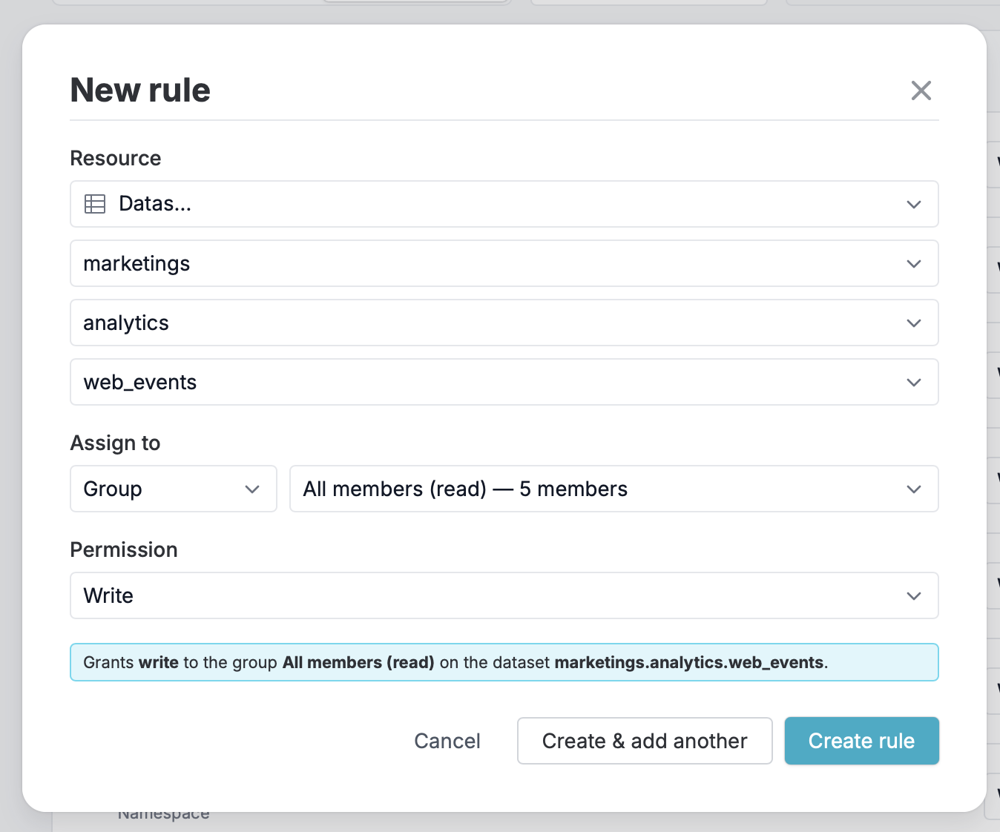
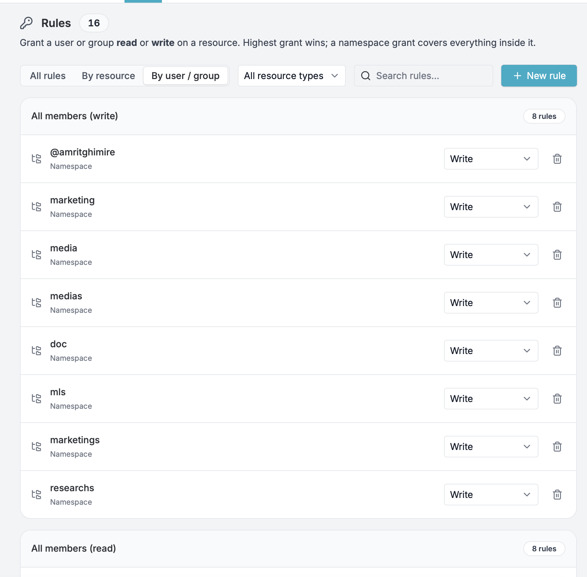

# Security & Permissions

**Permissions** decide what a collaborator can reach. Rules grant `read` or
`write` on individual namespaces, projects, and datasets, and without a rule a
collaborator reaches nothing. This is how you give someone access to a dataset.

A collaborator's **team role** sets a ceiling on top of that. A Viewer can only
ever read, whatever their grants say; an Editor can read and write. A role never
grants access to a resource on its own.

Admins are the exception to both. They can do everything, everywhere in the team,
and permission rules don't apply to them.

## How access works

Every request passes two checks, and both have to pass:

1. **Does your role allow this kind of action?** A Viewer can only read. An
   Editor can read and write.
2. **Do your permissions reach this resource?** Access comes from a rule
   targeting you or a group you belong to. Admins reach everything.

In practice that means a `write` grant on a Viewer does nothing until their role
changes to Editor, and an Editor with no grants sees no datasets at all.

Permissions resolve like this:

- **Access comes from a grant.** A rule targeting you, or a group you belong to,
  is what opens a resource.
- **Grants are additive, and the highest one wins.** When several rules apply to
  you, you get the strongest permission among them.
- **Rules cascade downward.** A rule on a namespace covers every project and
  dataset inside it. A rule on a project covers every dataset inside it.
- **Creating a namespace grants you `write` on it**, and by cascade on everything
  you put inside it.

**Example.** Say a dataset lives at `prod.analytics.metrics`. A rule granting the
`ml-team` group `read` on the `prod` namespace lets every member of `ml-team`
read `prod.analytics.metrics`, along with everything else under `prod`. If one of
them also has a personal `write` rule on `prod.analytics.metrics`, they get
`write` on it — the higher grant wins.

These checks apply everywhere datasets are reached: the web dashboard, the API,
and running DataChain jobs, where `dc.read_dataset(...)` runs under the
submitting user's grants.

## Roles

Every collaborator has one of three team roles.

- **`Admins`** - Can do everything in the team, on every resource. They see and
  modify every namespace, project, and dataset regardless of the rules, and they
  manage collaborators, groups and rules, team settings, cloud credentials, and
  billing.
- **`Editors`** - Can take write actions: creating datasets, running jobs, and
  working with queries and experiment projects. On datasets, an Editor can change
  the ones a `write` grant covers. They cannot change team settings, manage
  collaborators, or manage permissions.
- **`Viewers`** - Can take read actions only. A Viewer explores jobs and
  experiments, and reads the datasets a grant covers. A `write` grant does not
  let a Viewer edit a dataset; it takes effect when their role becomes Editor.

Whoever creates the team gets the `Admin` role.

Datasets, and the namespaces and projects around them, are governed by grants.
Jobs, queries, experiments, and storage are governed by the role alone.

!!! note

    If your Git account does not have write access on the Git repository connected
    to a project, you cannot push changes (e.g., new experiments) to the repository
    even if the project belongs to a team where you are an `Editor` or `Admin`.

### Privileges for datasets

The Read and Write columns are grants. Write actions need the Editor role as
well, so a Viewer holding a `write` grant still cannot perform them.

| Feature                     | Read | Write | Admin |
| --------------------------- | ---- | ----- | ----- |
| List datasets               | Yes  | Yes   | Yes   |
| View dataset information    | Yes  | Yes   | Yes   |
| View dataset rows           | Yes  | Yes   | Yes   |
| View dataset versions       | Yes  | Yes   | Yes   |
| Export datasets             | Yes  | Yes   | Yes   |
| Preview files               | Yes  | Yes   | Yes   |
| Create datasets             | No   | Yes   | Yes   |
| Edit dataset metadata       | No   | Yes   | Yes   |
| Delete datasets             | No   | Yes   | Yes   |
| Upload files                | No   | Yes   | Yes   |
| Move files in storage       | No   | Yes   | Yes   |
| Delete files                | No   | Yes   | Yes   |
| Reindex storage             | No   | Yes   | Yes   |
| Create dataset from storage | No   | Yes   | Yes   |

### Privileges for jobs

| Feature              | Viewer | Editor | Admin |
| -------------------- | ------ | ------ | ----- |
| List jobs            | Yes    | Yes    | Yes   |
| View job details     | Yes    | Yes    | Yes   |
| View job logs        | Yes    | Yes    | Yes   |
| List clusters        | Yes    | Yes    | Yes   |
| Create jobs          | No     | Yes    | Yes   |
| Cancel running jobs  | No     | Yes    | Yes   |
| Update job status    | No     | Yes    | Yes   |

The datasets a job reads and writes still follow the submitter's grants.

### Privileges for queries

| Feature                 | Viewer | Editor | Admin |
| ----------------------- | ------ | ------ | ----- |
| List queries            | Yes    | Yes    | Yes   |
| View query details      | Yes    | Yes    | Yes   |
| Create queries          | No     | Yes    | Yes   |
| Update queries          | No     | Yes    | Yes   |
| Duplicate queries       | No     | Yes    | Yes   |
| Delete queries          | No     | Yes    | Yes   |

### Privileges for experiments

| Feature                                       | Viewer | Editor | Admin |
| --------------------------------------------- | ------ | ------ | ----- |
| Open a team's project                         | Yes    | Yes    | Yes   |
| View experiments and metrics                  | Yes    | Yes    | Yes   |
| Apply filters                                 | Yes    | Yes    | Yes   |
| Show / hide columns                           | Yes    | Yes    | Yes   |
| Save filters and column settings              | No     | Yes    | Yes   |
| Add a new project                             | No     | Yes    | Yes   |
| Edit project settings                         | No     | Yes    | Yes   |
| Delete a project                              | No     | Yes    | Yes   |
| Share a project                               | No     | Yes    | Yes   |

### Privileges for storage and activity logs

| Feature                  | Viewer | Editor | Admin |
| ------------------------ | ------ | ------ | ----- |
| List storage files       | Yes    | Yes    | Yes   |
| View activity logs       | Yes    | Yes    | Yes   |
| Create activity logs     | No     | Yes    | Yes   |
| Get presigned URLs       | No     | Yes    | Yes   |

### Privileges to manage the team

Managing the team is governed by the role alone, and is reserved for admins:

| Feature                            | Viewer | Editor | Admin |
| ---------------------------------- | ------ | ------ | ----- |
| Manage team settings               | No     | No     | Yes   |
| Manage team collaborators          | No     | No     | Yes   |
| Manage groups and permission rules | No     | No     | Yes   |
| Configure cloud credentials        | No     | No     | Yes   |
| Manage GitLab server connections   | No     | No     | Yes   |
| Configure Single Sign-on (SSO)     | No     | No     | Yes   |
| Manage team plan and billing       | No     | No     | Yes   |
| Delete a team                      | No     | No     | Yes   |

## Permissions

Permissions are how you give collaborators access to datasets. Sort people into
**groups**, then write **rules** that grant `read` or `write` on the resources
they need.

You'll find them under **Collaborators & Permissions** in the
[team settings](settings.md) page, below the Collaborators list. This area is
**admin-only**.



### Resources

A rule targets one resource. Datasets sit in a hierarchy, addressed as:

```
<namespace>.<project>.<dataset>
```

for example `prod.analytics.metrics`. A rule can target any level of it and
**cascades downward**: a rule on the `prod` namespace covers every project and
dataset inside it, and a rule on `prod.analytics` covers every dataset in that
project. For more on how datasets are organized, see
[Organizing Datasets with Namespace and Project](../../../guide/namespaces.md).

### Groups

Groups bundle people so one rule can grant access to many at once.

To create a group, open the **Groups** section and click **New group**. Give it a
name (for example, `ML Platform`) and an optional description. Tick **Add all N
team members** to seed the group with everyone currently on the team. That is a
one-time snapshot, so new teammates aren't added automatically.



To manage an existing group, use its edit button. From there you can rename it,
edit its description, and add or remove members. Removing a member revokes any
access they had through that group.



Deleting a group also removes every rule granted through it. Members lose that
access but keep their team role. Deletion can't be undone.

### Rules

A rule grants a user or a group `read` or `write` on one resource. The highest
matching grant wins, and a namespace grant covers everything inside it (see
[How access works](#how-access-works)).

To add a rule, open the **Rules** section and click **New rule**:

1. **Pick the resource.** Choose the resource type, then select it through the
   cascading pickers. For a dataset you pick its namespace, then its project,
   then the dataset.
2. **Assign it.** Choose whether the rule targets a **group** or a **user**, then
   pick which one.
3. **Choose the permission**: **Read** (view only) or **Write** (read & modify).



Before you save, the dialog spells out what the rule grants, including the
cascade (for example, "…including every project and dataset inside it"). If a
rule for that user or group on that resource already exists, the dialog offers to
update it to the new permission. Use **Create & add another** to add several
rules without re-walking the resource picker.

Browse existing rules three ways — **All rules**, **By resource**, or **By user /
group** (the default) — and filter by resource type or search. You can change a
rule's permission inline from its row, or delete it.



## Next Steps

- [Manage collaborators](settings.md#edit-collaborators) and the rest of your
  [team settings](settings.md)
- [Configure Single Sign-on](../authentication/single-sign-on.md) so members
  authenticate through your identity provider
- Read up on [namespaces and projects](../../../guide/namespaces.md), the
  hierarchy that rules cascade through
